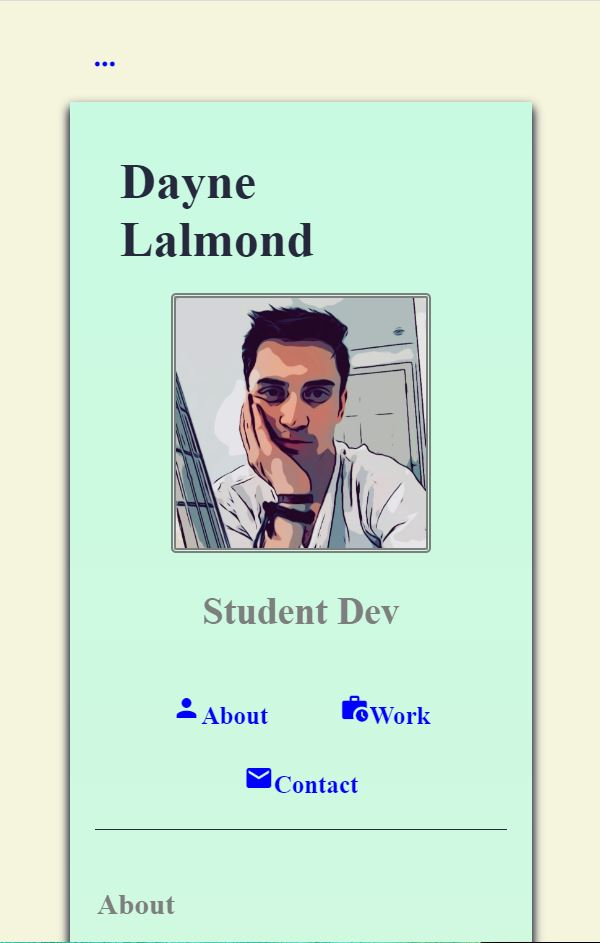

## Lalmond Portfolio

## Deployed Link
https://daynelalmond.github.io/Lalmond_Portfolio/

## Screenshot

## Description

A rough draft of my portfolio developed with the use of HTML and CSS code only. My experience with these programs
upon this assignment allowed me to aquire a better understanding of how tags associate with their element. I enjoyed
experimenting with CSS properties to give this project more depth.

## Features

The transition and animation features were made with CSS properties. I understand this could be more efficient with
javascript. I plan to continue advancing my portfolio until I believe it is ready to be released for employers.

